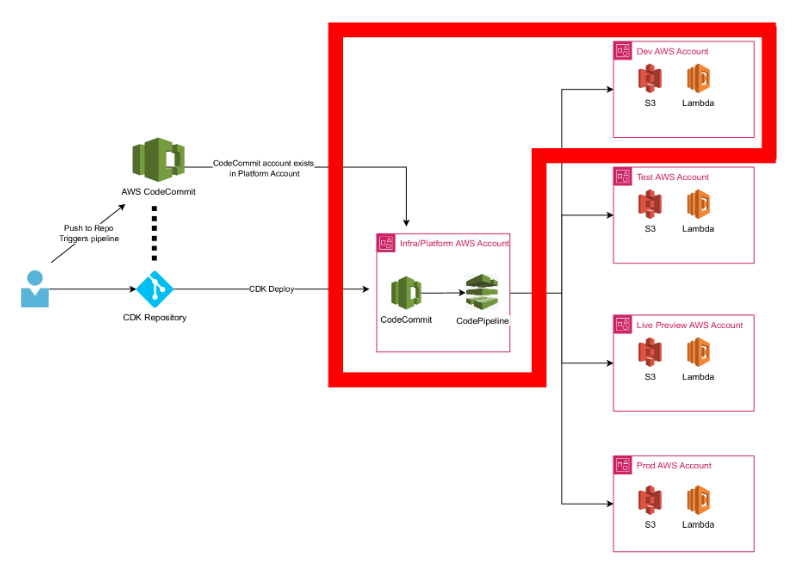

# Overview
## Diagram

## CDK Quickstart

See diagram above.  What is outlined in red is what this repository is applicable to.  There is an AWS Account for the "Platform" and there is an AWS account for the resouces a pipeline deploys to, which is a "Dev" account.  It can be extended to multiple environments easily, as the diagram illustrates.

This document includes all steps to how this repository and pipeline were built, including the workstation setup.  This repository can simply be cloned locally and development can being after updating parameters particular to your app.  Parameters include, but are not limited to, the following:

> 1.  Update the account numbers in cdk.json to reflect your platform/dev accounts.
> 2.  Update the pipeline name variable in cdk.json to reflect what you want the base of your pipeline to be called.
> 3.  To extend to more than just a dev account, add variables in the cdk.json for those accounts and uncomment the sections in app.py.
> 4.  Each stack has an applicable "Context" in cdk.json.  Update these sections for your particular app.
> 5.  To change the stacks your pipeline deploys, update the PipelineAppStage class.

**Note:  This repo is under constant development and without modification will install various AWS services to the Dev account.  To pick and choose what services you wish to install, update the infra\application_stage.py stack and remove unwanted classes.**

## Windows Workstation Setup - Note: You may need temporary administrator access

> 1.  Download and Install the latest supported version of Python: **https://www.python.org/downloads/**
> 2.  Download and Install the latest version of Node.js: **https://nodejs.org/en/download/**
> 3.  Download and Install the AWS CLI: **https://docs.aws.amazon.com/cli/latest/userguide/getting-started-install.html**
> 4.  Install Git for windows: **https://git-scm.com/download/win**
> 5.  Install aws-CDK prerequisites: **npm install -g aws-cdk**
> 6.  Install python language-specific prerequisites: **python -m pip install aws-cdk-lib**
> 7.  Install git-remote-codecommit: **pip install git-remote-codecommit**

## AWS SSO Setup
Configuration of the CLI with a profile will be dependent on the setup of your environment.  This will be geared towards AWS SSO integrated with Azure AAD.

> 1. Open a windows command prompt
> 2. Add AWS SSO session: **aws configure sso-session**

SSO session name: **Name your SSO Session**\
SSO start URL [None]: **Enter the start URL for your org**\
SSO region [None]: **Enter your region**\
SSO registration scopes [sso:account:access]: **Leave blank**

> 3. Add AWS SSO Platform Profile to session: **aws configure sso --profile cdk-demo-platform**

SSO session name (Recommended): **Name your SSO Session**\
**Scroll through the list of accounts and select the platform account**\
CLI default client Region [None]: **Enter your region**\
CLI default output format {None]: **json**

> 4. Add AWS SSO Dev Profile to session: **aws configure sso --profile cdk-demo-dev**

SSO session name (Recommended): **SSOSessionName**\
**Scroll through the list of accounts and select the dev account**\
CLI default client Region [None]: *Enter your region**\
CLI default output format {None]: **json**

> **Note:  If you have to reathenticate your session, you do so by running the following(using dev as an example):  **aws sso login --profile cdk-demo-dev**

## Create CodeCommit repository

> 1. Using the aws CLI, create the repository in the platform account:
  
  **aws codecommit create-repository --repository-name cdk-demo-repo --repository-description "CDK Demo repo" --profile cdk-demo-platform**
  
## Clone the repository locally.
This uses GRC syntax, the syntax is of the form: git clone codecommit::**region**://**profile**@**repository name**:
 
> 1. Change to the directoyr of the folder you wish to clone the repository to.  i.e. c:\source
> 2. Clone the repo: **git clone codecommit::us-east-1://cdk-demo-platform@cdk-demo-repo**

## Create a new CDK project within folder cloned from previous step

> 1. Change to the folder the project was cloned to locally:  i.e. **cd \source\cdk-demo-repo**
> 2. Initialize the folder with python dev stack: **cdk init --language python**
  
## Activate the Virtual Environment

> 1. Run: **.venv\Scripts\activate.bat**

## Install Requirements

> 1. Run: **pip install -r requirements.txt**

## Bootstrap Platform Account
  
> 1. Run: **cdk bootstrap --profile cdk-demo-platform**

## Bootstrap Dev Account

Since the whole goal here is to have CodeCommit and CDK Pipelines running in the platform account, but deploying to the Dev (test/prod) account, we need to bootstrap the Dev account so that it trusts the Platform account.  To do this you'll need the account number of the Platform and dev account.  You can get this by running the following command: \

aws sts get-caller-identity --query "Account" --profile cdk-demo-platform\
aws sts get-caller-identity --query "Account" --profile cdk-demo-dev

Syntax for the trust is: **cdk bootstrap --profile "Dev account profile name" --cloudformation-execution-policies 'arn:aws:iam::aws:policy/AdministratorAccess' --trust "Platform Account Number" aws://"Dev Account Number"/us-east-1**

> 1. Bootstrap Dev account replacing 0's with real account number: **cdk bootstrap --profile cdk-demo-dev --cloudformation-execution-policies 'arn:aws:iam::aws:policy/AdministratorAccess' --trust 000000000000 aws://000000000000/us-east-1**

## Add Platform and Dev account variables to cdk.json

cdk.json is going to contain all parameter that are consumed by the constructs and app.py entry point

> 1. Add the following section to the "context" section of cdk.json, replacing 0's with real account numbers.  These will be referenced in app.py\
>
    "platformaccount": "000000000000",\
    "devaccount": "000000000000",
    
## Mono Repo
 
> 1. Create a folder called "Infra" in the root of the repo: **mkdir c:\source\cdk-demo-repo\infra**

## Add tags.json file to root of repository (see repo)

CDK will tag everything it deploys with tags defined in the tags.json. 

## Update repository

> 1.  Update app.py
> 2.  Add infra\pipeline_stack.py (You'll have to update parameters paritcular to your pipeline name, and be sure to update the context in cdk.json)
> 4.  Add infra\application-stage.py
> 5.  Add infra\lambda_stack.py
> 6.  Add infra\s3_stack.py
> 7.  Add all all infra\demo\* folders

## Deploy the pipeline to the platform account
Note:  The pipeline name is the name of the pipeline construct.  To view your construct simply type: **cdk ls** from the root of your repository.  Be sure to use the correct profile for the Platform account.
> 1. Run: **cdk deploy demo-pipeline-dev --profile cdk-demo-platform**

## Quick tips

> 1.  Pipelines are self mutating so you only need to deploy the pipeline ONCE, all subsuquenst deploysments get triggered when the REPO is pushed to.
